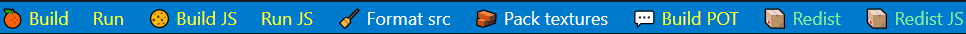

# About

Base structure for my games forked from (https://github.com/deepnight/gameBase).
The language is **Haxe** (https://haxe.org).
Builds are done with **Hashlink** (https://hashlink.haxe.org), a virtual machine, working on all platforms. 
And using **Heaps** (https://heaps.io), a 2D/3D Haxe library (*ie.* an Haxelib). All of those tools are free and open-source.

# Installation & usage

- First you can follow points 1 to 5 of this tutorial from *Sébastien Bénard* : https://deepnight.net/tutorial/a-quick-guide-to-installing-haxe/
- Install libs as follow : 
	`haxelib git deepnightLibs https://github.com/deepnight/deepnightLibs.git`
	`haxelib git castle https://github.com/ncannasse/castle.git`
	`haxelib git domkit https://github.com/HeapsIO/domkit.git` 
	`haxelib install redistHelper` for the redist packing tasks
	`haxelib install formatter` for the format src task
- Install Java to use the texture packing task
- Download it into your local repository or fork this project then clone yours 
- Open the root folder with vscode
- Press F1 then `Haxe: select configuration` and select hl.debug.hxml
- Execute the task `Pack textures`
- Press F5 to launch the game in debug or use the command bar buttons (see below)

## Tools and optionnal setup

- Visual Studio Code Command bar (id: gsppvo.vscode-commandbar) is recommended.
	
- gettext Language Support for Visual Studio Code (id: mrorz.language-gettext)

## Norms

We are using the UpperCamelCase for file and class names. This means all worlds are next to each other without space and must start with an uppercase. `-` are allowed for different file versions (*eg.* Robot.png and Robot-Blue.png or Robot-Normal.png).
Folders must be in lowerCamelCase (same but the first word has no starting uppercase) as well as variables and functions.

# Questions & Ressources

## Exporting a new font

https://community.heaps.io/t/creating-bitmap-fonts-not-working-for-me/382/5

## Yanrishatum's "Unnoficial Heaps FAQ"

https://gist.github.com/Yanrishatum/ae3725a9e2b45e0766c065e573ed1f24

## Yanrishatum's "How to compile HL/C"

https://gist.github.com/Yanrishatum/d69ed72e368e35b18cbfca726d81279a

## Package and distribute with HashLink

https://github.com/HaxeFoundation/hashlink/wiki/Distribution-&--Packaging

# Other ressources

- [CastleDB](http://castledb.org/) for the game database
- [Codecks](http://codecks.io/) for the project management
- [LibGDX Texture Packer](https://github.com/libgdx/libgdx/wiki/Texture-packer) for packing texture
- Debug font from Heaps samples
- [binding](https://github.com/haddock7/hlimgui) for [Dear ImGui](https://github.com/ocornut/imgui)